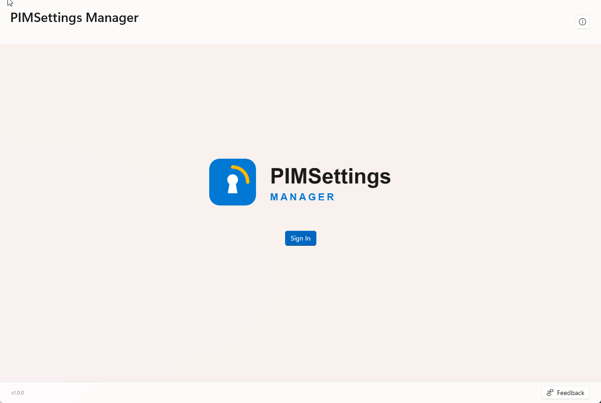
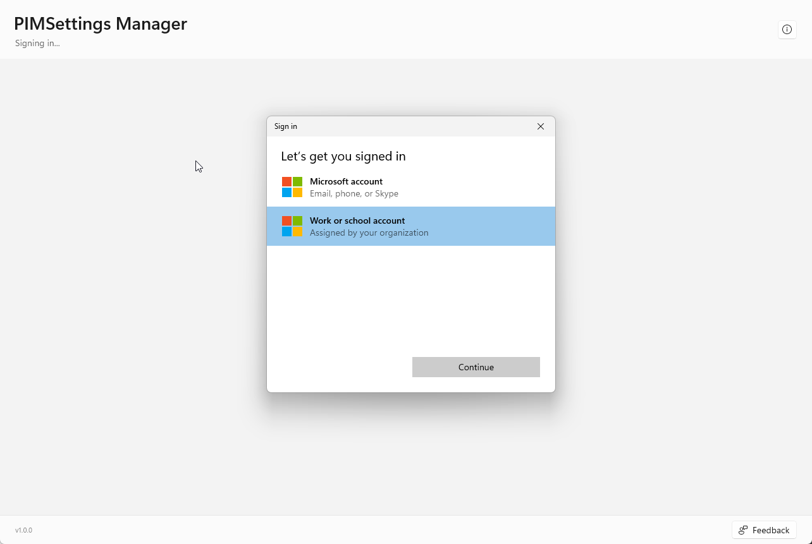
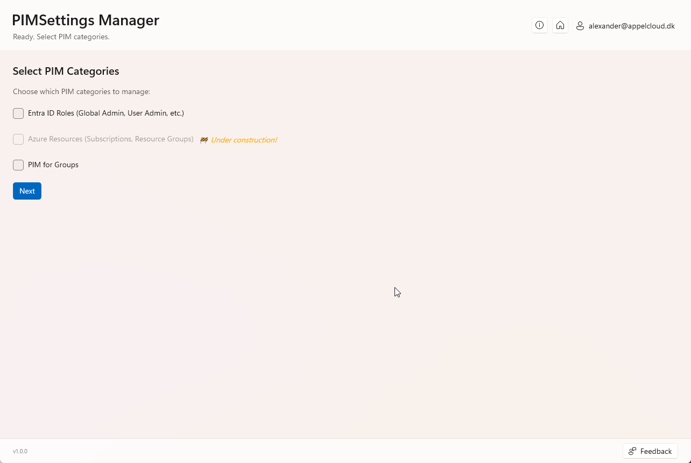
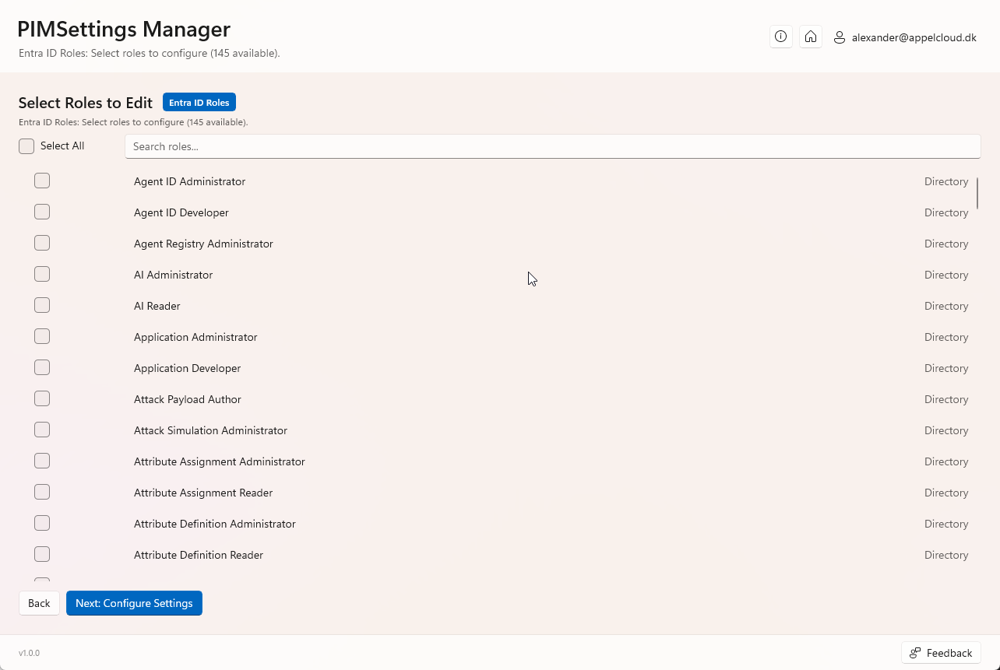
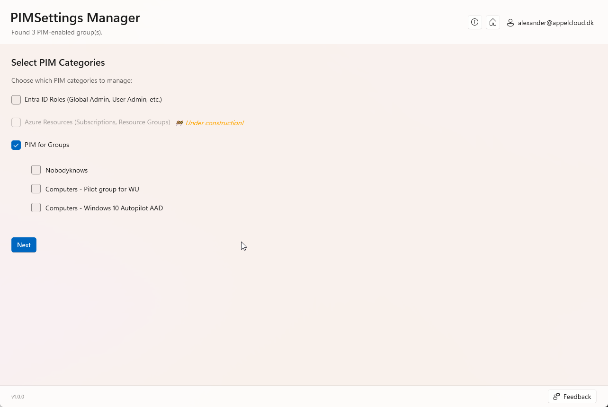
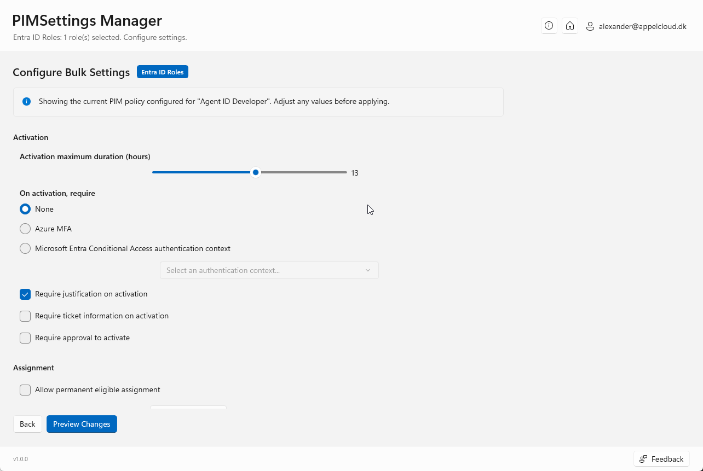
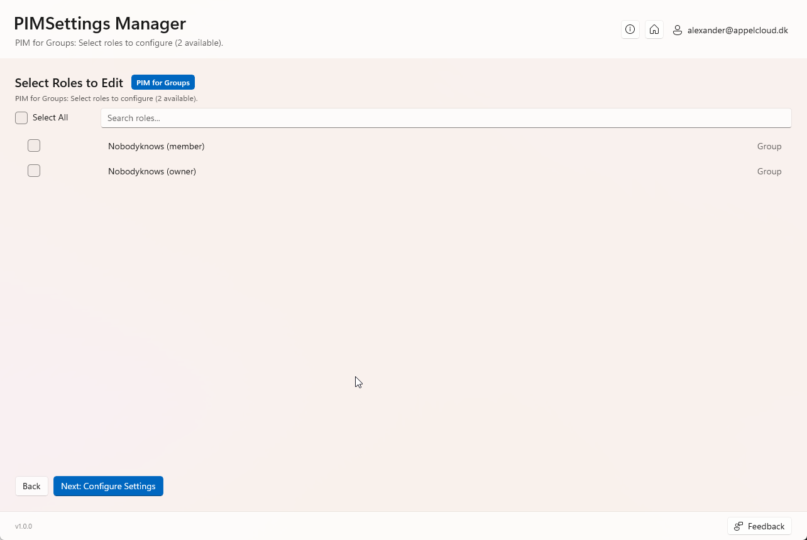
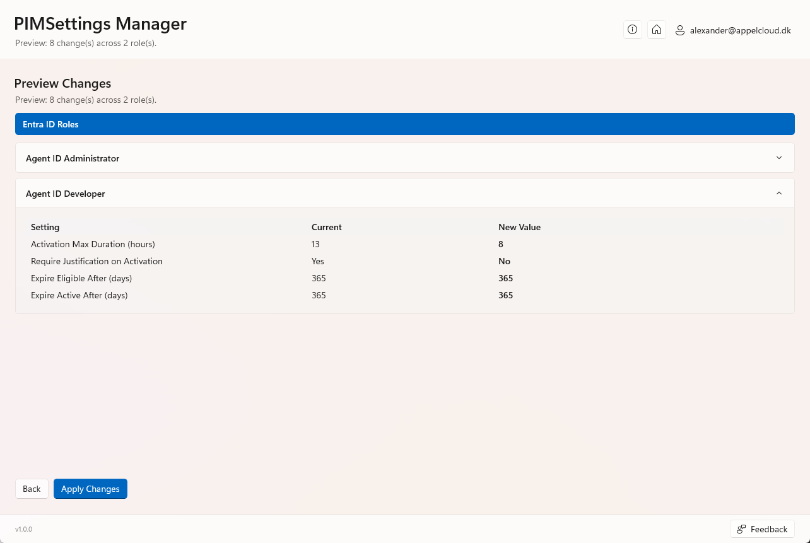

# PIMSettings Manager

<p align="center">
  
</p>

<p align="center">
  <a href="https://github.com/Appelcloud/PimSettingsManager/releases/latest"></a>
  <a href="https://github.com/Appelcloud/PimSettingsManager/releases/latest"></a>
  <a href="https://github.com/Appelcloud/PimSettingsManager/releases"></a>
  <a href="https://github.com/Appelcloud/PimSettingsManager/releases/latest"></a>
  <a href="https://github.com/Appelcloud/PimSettingsManager/commits/main"></a>
  
  
</p>

A Windows desktop tool that lets you configure **Microsoft Entra PIM (Privileged Identity Management) settings for many roles at once**. Pick the roles, set the policy once, preview the changes, and apply - instead of editing every role by hand in the portal.

## What it can do

- **Entra ID Roles** - bulk edit PIM settings for directory roles (Global Administrator, User Administrator, etc.)
- **PIM for Groups** - bulk edit the member and owner settings of PIM-enabled groups
- **Different settings per category** - configure Entra ID Roles and PIM for Groups separately in the same session
- **Starts from your current policy** - the settings page is pre-filled with the existing PIM policy of the selected role
- **Preview before applying** - see every change as *Current → New value*, grouped by category and role
- **Local logging** - every session is logged for troubleshooting

> **Note:** Azure Resources (subscriptions, resource groups) is shown in the app but is still under construction.

### Settings you can configure

| Area | Settings |
|---|---|
| **Activation** | Maximum duration (hours) · Require nothing, Azure MFA or a Conditional Access authentication context · Require justification · Require ticket information · Require approval (with user/group approvers) |
| **Assignment** | Allow permanent eligible / active assignment · Expire eligible / active assignment after (days) · Require MFA on active assignment · Require justification on active assignment |
| **Notifications** | Email notifications for eligible assignments, active assignments and activations - to admins, assignees/requestors and approvers |

## Prerequisites

**On your PC**

| Requirement | How to get it |
|---|---|
| Windows 10 version 1809 (build 17763) or later, or Windows 11 - x64 | - |
| .NET 8 Desktop Runtime (x64) | [Download](https://dotnet.microsoft.com/download/dotnet/8.0) or `winget install Microsoft.DotNet.DesktopRuntime.8` |
| Windows App SDK 2.2 runtime (x64) | [Download](https://learn.microsoft.com/windows/apps/windows-app-sdk/downloads) |

**In your tenant**

- Microsoft Entra ID P2 license (required for PIM)
- An account that is allowed to manage PIM settings (for example **Privileged Role Administrator**)
- Consent to the delegated Microsoft Graph permissions below. The tool signs in with the Microsoft Graph Command Line Tools app (`14d82eec-204b-4c2f-b7e8-296a70dab67e`), so an administrator may need to grant consent the first time.

| Permission | Used for |
|---|---|
| `RoleManagementPolicy.ReadWrite.Directory` | Read and update PIM policies for Entra ID roles |
| `RoleManagement.ReadWrite.Directory` | Read Entra ID role definitions and policy assignments |
| `RoleManagementPolicy.ReadWrite.AzureADGroup` | Read and update PIM policies for groups |
| `PrivilegedAccess.ReadWrite.AzureADGroup` | List PIM-enabled groups |
| `PrivilegedAccess.ReadWrite.AzureResources` | Azure Resources (under construction) |
| `Directory.Read.All` | Look up users, groups and authentication contexts |
| `User.Read` | Show the signed-in user |

## Getting started

1. Download **`tool.zip`** from the [Releases](https://github.com/Appelcloud/PimSettingsManager/releases) page.
2. **Extract** `tool.zip` to a folder on your PC.
3. Open the extracted `tool` folder and run **`PIMSettings Manager.exe`**.

## How to use it

### 1. Sign in
Click **Sign In**.



### 2. Authenticate
Choose **Work or school account** and sign in with your Entra ID account.



### 3. Pick PIM categories
Select what you want to manage: **Entra ID Roles**, **PIM for Groups**, or both.



### 4. Select Entra ID roles
Search or use **Select All** to pick the roles you want to configure.



### 5. Select PIM groups
When **PIM for Groups** is checked, the PIM-enabled groups in your tenant are listed. Select the groups you want to configure.



### 6. Configure Entra ID role settings
Adjust the activation, assignment and notification settings. The page starts with the current policy of the selected role.



### 7. Configure PIM group settings
Select the group roles (member and/or owner) to configure, then set their settings the same way.



### 8. Preview and apply
Review every change per role (*Current* vs. *New Value*), then click **Apply Changes**.



## Logs

Log files are saved per session in:

```
%LocalAppData%\PIMSettingsManager\Logs
```

## Built with

| Dependency | Version |
|---|---|
| [.NET](https://dotnet.microsoft.com/) | 8.0 |
| [Windows App SDK / WinUI 3](https://learn.microsoft.com/windows/apps/windows-app-sdk/) | 2.2.0 |
| [Microsoft Authentication Library (MSAL)](https://learn.microsoft.com/entra/msal/) + Broker (Windows sign-in) | 4.67.2 |
| [CommunityToolkit.Mvvm](https://learn.microsoft.com/dotnet/communitytoolkit/mvvm/) | 8.4.0 |
| [Microsoft Graph API](https://learn.microsoft.com/graph/) (beta endpoint) | - |

## Author

**Alexander Appelby** - Microsoft 365 & Security MVP

- [Blog](https://blog.appelcloud.dk)
- [Tools Hub](https://tools.appelcloud.dk)
- [MVP Profile](https://mvp.microsoft.com/en-US/mvp/profile/12ef06cd-cdab-4545-b87d-b7b682dd0d67)
- [LinkedIn](https://dk.linkedin.com/in/alexander-appelby)

## License

This project is proprietary. All rights reserved.
