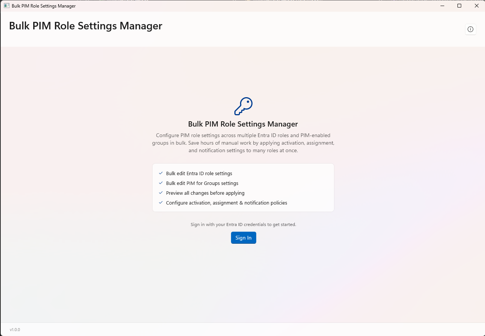
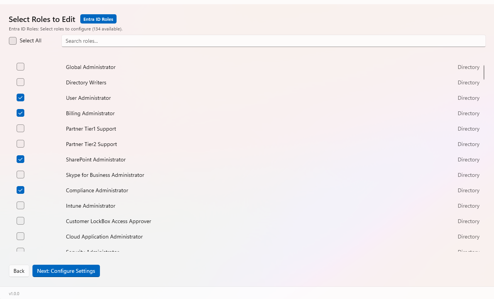
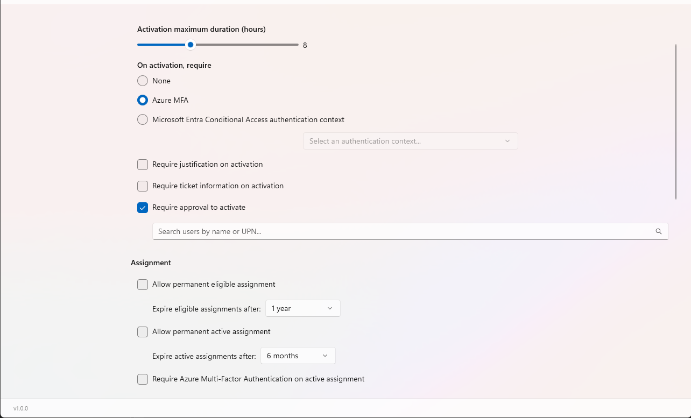

# Bulk PIM Role Settings Manager

A Windows desktop tool for configuring PIM (Privileged Identity Management) role settings across multiple Entra ID roles and PIM-enabled groups in bulk. Save hours of manual work by applying activation, assignment, and notification settings to many roles at once.

## Features

- **Bulk edit Entra ID role settings** — Select multiple directory roles and configure them simultaneously
- **Bulk edit PIM for Groups settings** — Apply settings to PIM-enabled security groups
- **Preview all changes before applying** — Review a detailed summary grouped by category before committing
- **Configure activation, assignment & notification policies** — Full control over MFA, justification, approval, expiration, and email notifications
- **Per-category configuration** — Set different policies for Entra ID roles vs. PIM Groups in a single session

## Screenshots

### Home

### Role Selection

### Settings Configuration

## Requirements

- Windows 10 (build 17763+) or Windows 11
- .NET 8 Desktop Runtime
- Entra ID account with `RoleManagement.ReadWrite.Directory` permissions
- Microsoft Entra ID P2 license (for PIM)

## Getting Started

1. Download the latest release from [Releases](https://github.com/youruser/BulkPimRoleSettings/releases)
2. Run the application
3. Sign in with your Entra ID credentials
4. Select the PIM categories you want to manage
5. Choose roles, configure settings, preview, and apply!

## Permissions Required

The application uses delegated permissions via MSAL (Microsoft Authentication Library):

| Permission | Purpose |
|---|---|
| `RoleManagement.ReadWrite.Directory` | Read and update PIM role policies |
| `Directory.Read.All` | List roles, groups, and users |

## Built With

- [WinUI 3](https://learn.microsoft.com/en-us/windows/apps/winui/winui3/) — Modern Windows UI framework
- [CommunityToolkit.Mvvm](https://learn.microsoft.com/en-us/dotnet/communitytoolkit/mvvm/) — MVVM architecture
- [Microsoft Identity Client (MSAL)](https://learn.microsoft.com/en-us/entra/msal/) — Authentication
- [Microsoft Graph API](https://learn.microsoft.com/en-us/graph/) — PIM policy management

## Author

**Alexander Appelby** — Microsoft 365 & Security MVP

- [Blog](https://blog.appelcloud.dk)
- [Tools Hub](https://tools.appelcloud.dk)
- [MVP Profile](https://mvp.microsoft.com/en-US/mvp/profile/12ef06cd-cdab-4545-b87d-b7b682dd0d67)
- [LinkedIn](https://dk.linkedin.com/in/alexander-appelby)

## License

This project is proprietary. All rights reserved.
